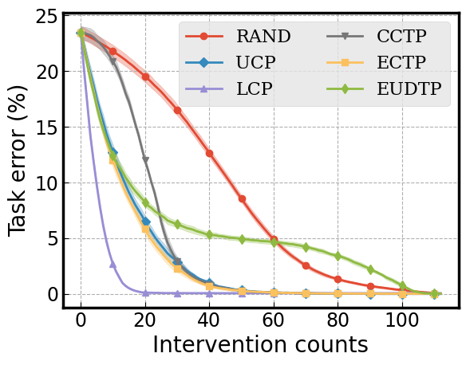

# A Closer Look at the Intervention Procedure of Concept Bottleneck Models

This repository contains source code for arXiv paper [A Closer Look at the Intervention Procedure of Concept Bottleneck Models](https://arxiv.org/abs/2302.14260) by Sungbin Shin, Yohan Jo, Sungsoo Ahn, and Namhoon Lee.

Our experiments are based on the following three datasets.

- [Caltech-UCSD Birds-200-2011 (CUB-200-2011)](https://www.vision.caltech.edu/datasets/cub_200_2011/)
- [SKIN Concepts Dataset (SkinCon)](https://skincon-dataset.github.io/)
- Synthetic

As of now, the repository only contains the code for the CUB dataset.
We will release the code for other datasets as soon as possible.

## TL;DR
We develop various ways of selecting intervening concepts to improve the intervention effectiveness and conduct an array of in-depth analyses as to how they evolve under different circumstances.

## Abstract
Concept bottleneck models (CBMs) are a class of interpretable neural network models that predict the target response of a given input based on its high-level concepts.
Unlike the standard end-to-end models, CBMs enable domain experts to intervene on the predicted concepts and rectify any mistakes at test time, so that more accurate task predictions can be made at the end.
While such intervenability provides a powerful avenue of control, many aspects of the intervention procedure remain rather unexplored.
In this work, we develop various ways of selecting intervening concepts to improve the intervention effectiveness and conduct an array of in-depth analyses as to how they evolve under different circumstances.
Specifically, we find that an informed intervention strategy can reduce the task error more than ten times compared to the current baseline under the same amount of intervention counts in realistic settings, and yet, this can vary quite significantly when taking into account different intervention granularity.
We verify our findings through comprehensive evaluations, not only on the standard real datasets, but also on synthetic datasets that we generate based on a set of different causal graphs.
We further discover some major pitfalls of the current practices which, without a proper addressing, raise concerns on reliability and fairness of the intervention procedure.


|          |     |       |
|:--------------:|:----------:|:----------------------:|
| CUB | SkinCon | Synthetic |

## Requirements

Install the required libraries using the following command.
```
pip install -r requirements.txt
```

## Usage
See the readme file of each folder to check how to preprocess the dataset, train the models, and conduct test-time interventions.